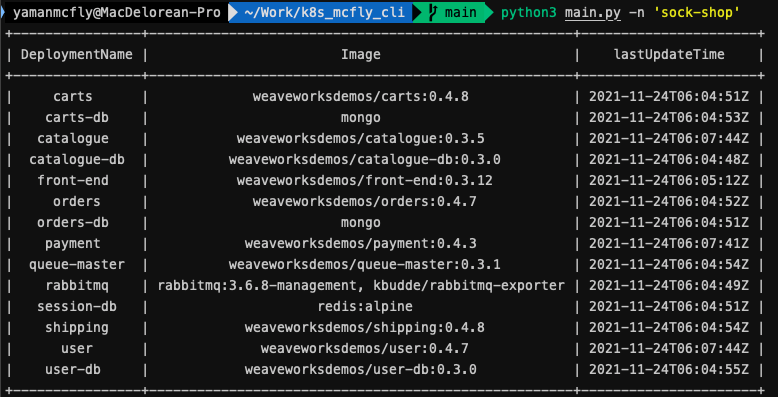

# k8s_mcfly_cli
Kubernetes CLI developed in python

## Requirements

- Python 2/3 and these pip packages:
  * PrettyTable
  * requests
  
- Minikube or K8S Cluster (exposing API)
  
  I have used the command 
  ` kubectl proxy --port=8080 `

## Examples

You run CLI with python a $NAMESPACE flag.

` python3 main.py -n $NAMESPACE `

` python3 main.py -n 'sock-shop' `

CLI has default APIURL configurated (http://localhost:8080/apis/)

But you can change with the flag **--apiurl**

` python3 main.py -n $NAMESPACE --apiurl $APIURL `

